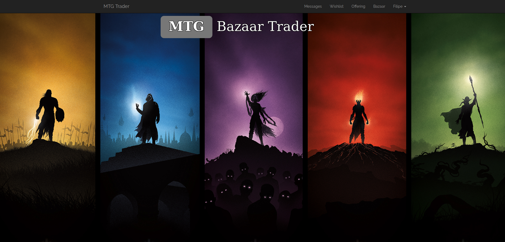
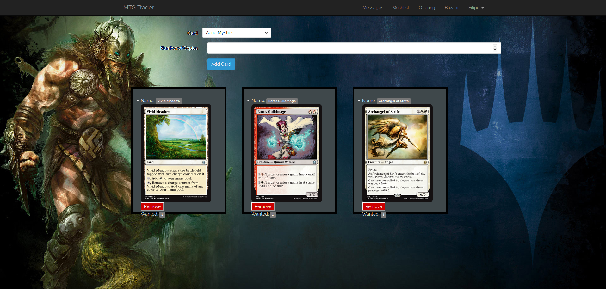
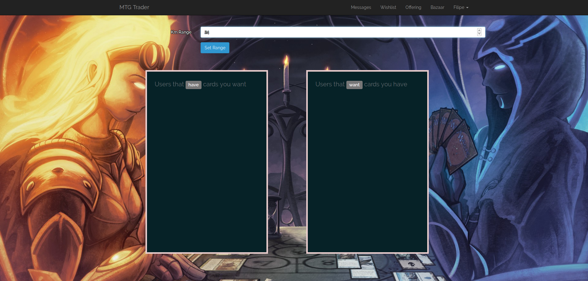
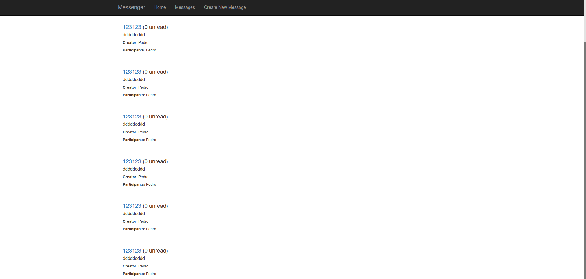

# Bazaar Trader

### Project Description

The project is based on a simple but powerfull idea. Making trading cards about **Trading Cards** again.

The basic rundown of the features is:
 * Users can register, supplying they Country, City, and Address.  
   The user is also encouraged to suply their phone number (*more on this later*)
 * The user can then register the cards he wants to have and the cards he wants to put up for trade.
 * Finaly there is the most important and distiguishing feature, the **BAZAAR**!  
   1. This displays users that have cards you want and users that want cards you have
   2. This list can be filtered with by distance, so you can set how far you want your trading reach to go
   3. You can then click these users to browse their __wishlist__ and __binder__
   4. Here you can also send a private message to the user and if he registered his phone number (and you have yours) you can send them an sms message using **Nexmo**!

The project is still in it's early stages so most things are still rough around the edges.

### Screenshots

### Home

### Wishlist

### Bazar (empty)

### Bazar (not-empty)

### Profile

### Messages

